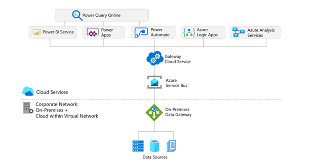
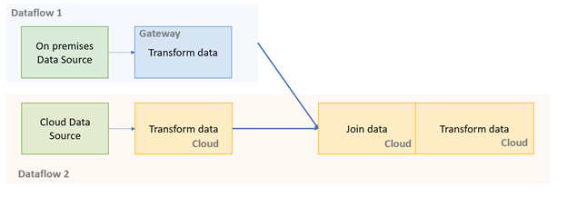
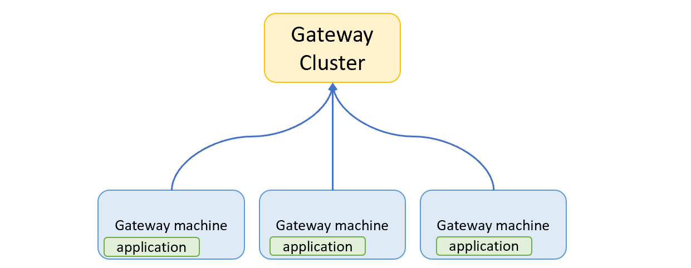

# On-premises Data Gateway Best Practises
A collection of best practises for the on-premises data gateway used by the Power Platform and Power BI

## What is the Gateway?
The on-premises data gateway acts as a bridge to provide quick and secure data transfer between on-premises data (data that isn't in the cloud) and several Microsoft cloud services. These cloud services include Power BI, Power Apps, Power Automate, Azure Analysis Services, and Azure Logic Apps. By using a gateway, organizations can keep databases and other data sources on their on-premises networks, yet securely use that on-premises data in cloud services. **The same on-premises data gateway can be used for all services.**

In this document we will focus on the best practises for the on-premises data gateway. We focus on highlighting these pratices for the Power Platform and Power BI. More information on how the on-premises data gateway works, check out the documentation for the different services:
* [Gernal Content](https://docs.microsoft.com/en-us/data-integration/gateway/service-gateway-onprem)
* [Power BI](https://docs.microsoft.com/en-us/power-bi/connect-data/service-gateway-onprem)
* [Power Apps](https://docs.microsoft.com/en-us/powerapps/maker/canvas-apps/gateway-reference)
* [Power Automate](https://docs.microsoft.com/en-us/power-automate/gateway-reference)
* [Logic Apps](https://docs.microsoft.com/en-us/azure/logic-apps/logic-apps-gateway-install)
* [Azure Analysis Services](https://docs.microsoft.com/en-us/azure/analysis-services/analysis-services-gateway )

### What is the difference between the on-premises data gateway and the Azure VPN gateway and the Application gateway?

Within Microsoft, there are three different gateways: The on-premises data gateway, the [VPN gateway](https://docs.microsoft.com/en-us/azure/vpn-gateway/vpn-gateway-about-vpngateways) and the [Application gateway](https://docs.microsoft.com/en-us/azure/application-gateway/overview). All gateways are slightly different and designed for different solutions. 
In this document we will focus on the on-premises gateway. This gateway is used by services on the Power Plarform, Power BI, Logic Apps and Azure Analysis Services. You can use the VPN gateway when you are connecting your on-premises data directly to Azure. The Application gateway is used for applications with a public facing browser, to create a safe connection between the internet and Azure. 

### Can the VPN gateway and the on premises gateway run on the same machine?
Yes, both gateways can run on the same machine, but it is not recommended. Both applications will probably transfer a lot of data. It is also harder to troubleshoot any of the two gateways when both are running on the same machine.

## When to use a on-premises data gateway?
On-premises data gateways are required when any of the above-mentioned services need to connect to data that has any of the following conditions:
* On-premises data sources
* Data sources/platform-as-a-service solutions which reside in a virtual machine
* Cloud data sources which reside within a virtual network
* Data sources that are in the same query/dataflow or dataset as datasources that require an on-premises data gateway
* When the [Web.Page()](https://docs.microsoft.com/en-us/powerquery-m/web-page) function is used in a query

A on-premises data gateway is however **not necessary** to access:
* Platform-as-a-service solutions in the cloud *(public ports)*
* Software-as-a-service solutions *(Salesforce/Google Analytics)*

### What is the best way to combine data from the cloud and data that requires an on-premises data gateway?
If you are using dataflows and are using both cloud data sources and data sources that require an on-premises data gateway, it is recommended to first create a seperate dataflow to load data from on-prem into the cloud (into a Data Lake thorugh analytical dataflows). For more information, look at these [best practises for re-using dataflows](https://docs.microsoft.com/en-us/power-query/dataflows/best-practices-reusing-dataflows). Now, when you want to join the dataflow with the cloud data source, the join will happen in the cloud and not on the gateway. This can help with taking off load of the gateway. 

### What types of queries exist in every application?
Across the products, there are different query types. Understanding different query types and their performance inmpact is useful for choosing the right gateway machin and while monitoring performance od the gateway. Types of queries supported by product:
* **Power BI Datsets**: Import, Direct Query, Live *(via Analysis Services)*
* **Power BI Dataflows**: Import
* **Power Apps**: Direct Query
* **Power Platform Dataflows**: Import
* **Power Automete**: Direct Query
* **Azure Analysis Services**: Import, Live 

## Types of Gateway
There are two different types of the on-premises data gateway.
* Personal gateway
* Standard gateway (previously know as enterprise gateway)

The personal mode is **only avaiable in Power BI**. In all other services, you can only use the standard gateway. The main  difference between the personal gateway and the standard gateway, is that the personal gateway can only be used by one individual, whereas the standard gateway can be used by anyone with permission. To learn more, take a look at the [documentation](https://docs.microsoft.com/en-us/data-integration/gateway/service-gateway-onprem#types-of-gateways).

### Why and when should I use a personal gatway?
At tenant level, the adminstator can control who can install gateways. allowing users to install a personal gateway on their own personal devices, makes it very easy for users to start connecting to on-premises data sources. The personal gateway is fast to set up and it makes it easy to use for prototyping or personal projects in the cloud. For more information on personal gateways, check the [documentation](https://docs.microsoft.com/en-us/power-bi/connect-data/service-gateway-personal-mode).

*Note: If you are usin R or Python scripts in ypur data preperation step in Power Query and you want to publish uour report to the cloud, you can only make use of the personal gateway.*

# Why do I need a personal gateway when using Python or R scripts?
This is because of the security risks of running R and python scripts on a shared platform.

### When do I need the standard gateway?
In all other applications, you can only install the standard gateway. Some Advantages/capabilities from the standard gateway are: 

* Multiple applications (like Power BI and Power Apps) can use the same gateway. 
* The gateway is intended to run on a server instead of a personal computer. 
* Support for Refresh, Direct Query and Live, while personal  has only support for Refresh 
* Privacy levels per data source can be configured. 
* Clustering for high availability and disaster recovery possible 
* Logging for activity and health monitoring 

### Should I use the same gateway cluster with different applications like Power Apps and Power BI?
With the standard gateway it is possible to attach multiple applciation to the same cluster. However, this is not always optimal.
Reasons to seperate the clusters:
* Power BI and Power Apps can have different hardware requirements (CPU or memory optimized)
* Different security roles in Power BI and Power Automate.
* Can be easier for trroubleshooting and management

### What is the difference between gateway application, gateway machine and gateway cluster?
* A **gateway application** is the application which helps woth on-prem onnectivity
* A **gateway machine** is the machine on which the gateway application is installed
* A **gateway cluster** is a logical grouping of gateway machines

### What are the benifits of high availability and load balancing?
If you have only one gateway member, then you have a single point of failure. Therefore, we recommenc having a least 2 gateway members on a cluster with high availability enabled. Addinionally enabling load balancing helps utilize recoucres of both gateway members effectively. 
* **High availability** eliminates having a simple point of failure
* **Load balancing** automatically distributes the workload across all gateway members in the cluster

## Should I use different clusters for dev/test and prid environmentd>
We would recommend using at least two separate clusters:
* 1 cluster for your dev/test environmtent
* 1 cluster for your prod environment

By doing this, anay changes that uou make, like adding a new data source, you can first test on your dev/test cluster before appying it in your production entironment. This will ensure that you production environmentnis not impacted by these changes.

